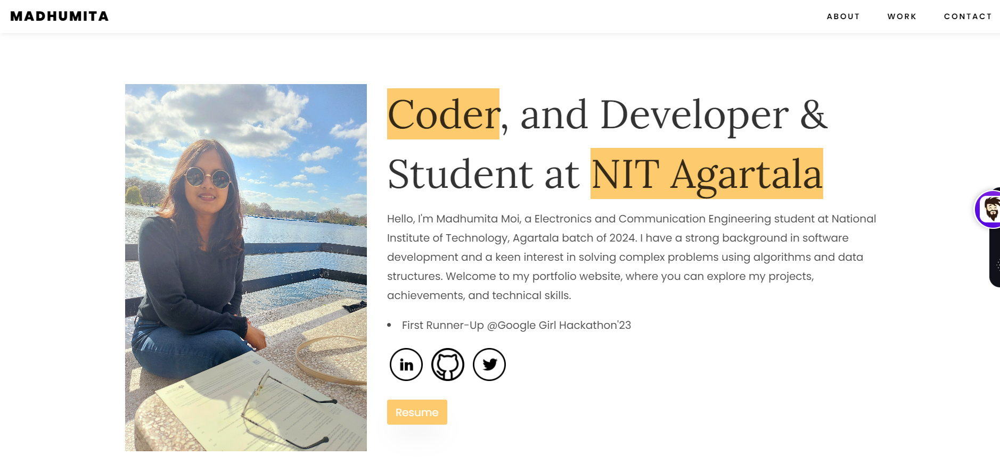

# My Portfolio Website

[Click here to check out my Website](https://madhumitamoi.github.io/Madhumita-Moi-Portfolio/)

# My Portfolio Website

Welcome to my personal portfolio website! This website showcases my projects, skills, and experiences. It uses HTML, CSS, and JavaScript to create a responsive and visually appealing user interface.

## Features

- **Responsive design:** The website is optimized for various screen sizes, including desktop, tablet, and mobile.
- **Project showcase:** Display a curated selection of my projects with details and live demos.
- **About me:** Learn about my background, skills, and interests.
- **Contact information:** Contact me through the provided contact form.
- **Smooth animations:** Enhance user experience with subtle animations and transitions.

## Technologies Used

- **HTML5:** Structure and content of the website.
- **CSS3:** Styling, layout, and responsive design.
- **JavaScript:** Interactivity and dynamic elements.
- **Font Awesome:** Icons for visual elements.
- **Google Fonts:** Typography customization.
- **Vanta.js:** Animated objects.

## Getting Started

To run the portfolio website locally on your machine, follow these steps:

1. Clone this repository: `git clone https://github.com/Madhumitamoi/PortfolioWB.git`
2. Navigate to the project directory: `cd PortfolioWB`
3. Open the `index.html` file in your web browser.

Alternatively, you can use a tool like Live Server to serve the website:

1. Install Live Server globally: `npm install -g live-server`
2. Navigate to the project directory: `cd PortfolioWB`
3. Start the server: `live-server`

The website will now be accessible at `http://localhost:8080`.

## License

This project is licensed under the MIT License - see the [LICENSE](LICENSE) file for details.

## Contact

Feel free to reach out to me with any questions or feedback:

- **Email:** madhumoi0266@gmail.com
- **LinkedIn:** [Madhumita Moi](https://www.linkedin.com/in/madhumita-moi/)
- **Twitter:** [@Madhumita_Moi](https://twitter.com/Madhumita_Moi)

[Click here for live](https://madhumitamoi.netlify.app/)
